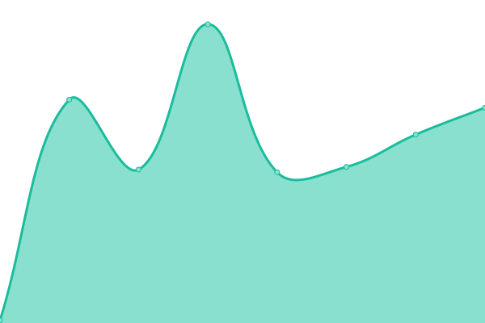

# [📈 Live Status](https://demo.upptime.js.org): <!--live status--> **🟧 Partial outage**

This repository contains the open-source uptime monitor and status page for [Upptime](https://upptime.js.org), powered by [Upptime](https://github.com/upptime/upptime).

With [Upptime](https://upptime.js.org), you can get your own unlimited and free uptime monitor and status page, powered entirely by a GitHub repository. We use [Issues](https://github.com/upptime/upptime/issues) as incident reports, [Actions](https://github.com/artemmukhin/package-search-upptime/actions) as uptime monitors, and [Pages](https://demo.upptime.js.org) for the status page.

<!--start: status pages-->
<!-- This summary is generated by Upptime (https://github.com/upptime/upptime) -->
<!-- Do not edit this manually, your changes will be overwritten -->
<!-- prettier-ignore -->
| URL | Status | History | Response Time | Uptime |
| --- | ------ | ------- | ------------- | ------ |
|  [Website](https://package-search.jetbrains.com/) | 🟩 Up | [website.yml](https://github.com/JetBrains/package-search-upptime/commits/HEAD/history/website.yml) | 

 68ms
     
 | 

<a href="https://JetBrains.github.io/package-search-upptime/history/website">100.00%</a>
    

|  [API (search)](https://api.dev.package-search.services.jetbrains.com/search-packages) | 🟥 Down | [api-search.yml](https://github.com/JetBrains/package-search-upptime/commits/HEAD/history/api-search.yml) | 

 1058ms
     
 | 

<a href="https://JetBrains.github.io/package-search-upptime/history/api-search">0.00%</a>
    

|  [API (ID lookup)](https://api.dev.package-search.services.jetbrains.com/package-info-by-ids) | 🟥 Down | [api-id-lookup.yml](https://github.com/JetBrains/package-search-upptime/commits/HEAD/history/api-id-lookup.yml) | 

 140ms
     
 | 

<a href="https://JetBrains.github.io/package-search-upptime/history/api-id-lookup">100.00%</a>
    

<!--end: status pages-->

[**Visit our status website →**](https://demo.upptime.js.org)

## 📄 License

- Powered by: [Upptime](https://github.com/upptime/upptime)
- Code: [MIT](./LICENSE) © [Upptime](https://upptime.js.org)
- Data in the `./history` directory: [Open Database License](https://opendatacommons.org/licenses/odbl/1-0/)
